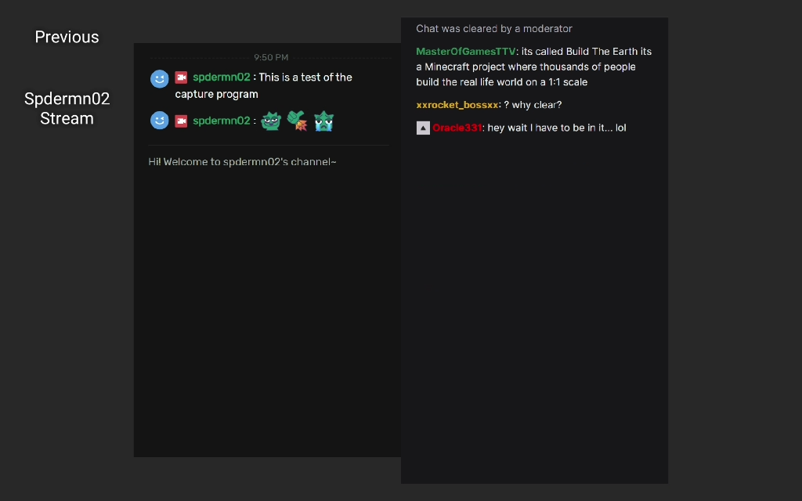
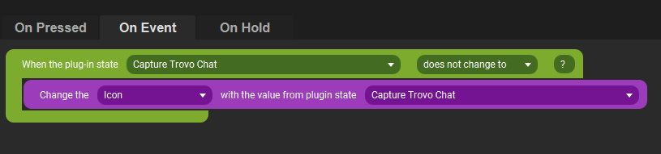
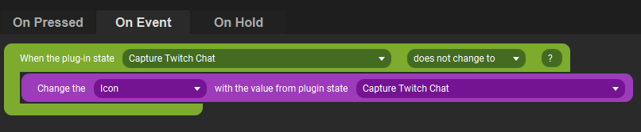
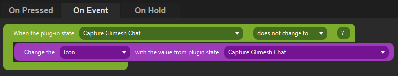

<h1>TouchPortal Webpage Capture Plugin</h1>

**Table Of Contents**
___
- [Description](#description)
- [Change Log](#change-log)
- [Installation](#installation)
- [Settings](#settings)
- [Webpage Capture Configuration](#webpage-capture-configuration)
  - [Examples](#examples)
- [Dependencies](#dependencies)
- [Versioning](#versioning)
- [Authors](#authors)
- [License](#license)
- [Bugs/Enhancements](#bugsenhancements)
- [Acknowledgements](#acknowledgements)
___

# Description
Capture any number of webpages at a set interval, width, and height. Even specify the element to capture if you do not need the entire window. Useful for capturing your Twitch or Trovo chat right into Touch Portal.

# Change Log
```
1.0.0 - Initial Release
  - Settings
    There are two settings that can be changed
    - Browser Executable Path
      Provides the ability to utilize your own browser outside of the included Chromium for rendinging pages. Mileage may very - only tested with built in Chromium and installed Chrome
        -Default: ./puppeteer/chrome.exe
        -Alt: C:/Program Files (x86)/Google/Chrome/Application/chrome.exe
    - Config Directory
      Provides for a config directory to be outside of the default %APPDATA%\TouchPortal\plugins\TPWebpageCapture\config directory, so that future re-imports of the plugin will not remove your configuration.
  - Actions
    There are no defined actions for this plugin, juse utilizes the built in Touch Portal plugin actions
  - Events
    There are no defined events for this plugin, just utilizes the built in Touch Portal plugin state events
  - States
    States are automatically created based on the configuration you setup for what you want to capture. These are created at startup of the plugin.
```


# Installation
1. Download the .tpp file the installer for your OS [Windows](https://github.com/spdermn02/TouchPortal_WebpageCapture_Plugin/tree/master/Installers/TPWebpageCapture-Win.tpp) OR MacOS (TBD)
1. Go to Touch Portal Settings (the gear icon)
2. Go To Plug-ins
3. Click the Import Plug-in button
4. Navigate to the downloaded tpp file, select it and press Open
5. A popup should tell you Successfully Imported plugin
   1. If this is your first time importing, you will be asked To Trust the Plugin, to prevent this from popping up each time you start Touch Portal, click Trust Always
6. Now Select Touch Portal Webpage Capture in the dropdown on the Plug-ins settings page
7. Change the settings to what you may need - see the [Settings](#settings) section below for what each setting means
8. If this is your first plugin, please do a full Exit and Reopen cycle of Touch Portal using the icon in the System Tray.
# Settings
There are only two settings currently that are configurable inside the Touch Portal Plugin Settings UI

**<h2>Browser Executable Path  </h2>** 

*Description*: Allows for changing which browser executable is used by puppeteer to capture the web pages. 

Default: 

    `./puppeteer/chrome.exe`
    This is packaged with the plugin itself, and the setting is defaulted to use it

If you are interested in maybe capturing you tube video, or twitch stream into Touch Portal, you will need to change to using a more "robust" browser. This plugin has been tested with Chrome that I have installed. the path below may be different for you if you don't use the C:/ drive construct

    `C:/Program Files (x86)/Google/Chrome/Application/chrome.exe`
    Could also possibly use Firefox if you prefer, but that hasn't been validated yet.

**<h2>Config Directory</h2>**

*Description*: Change the location of where your capture configuration files are defined. This will allow for updates to the plugin, but will not cause your configuration to get lost.  I recommend you change this to somewhere more permenant.

Default: 

    `./config/`
    It is important that the final / is there, else this can cause issues.
# Webpage Capture Configuration

In order to capture any webpage, you need to setup a configuration file for that web page.  Examples are below at [Examples](#examples). The state name of your Capture will be built from the filename of your cnf file. **DO NOT** have your file name contain a period, except for the extension `.cnf` 

Adding in a configuration file, for the time being, will require a restart of the plugin at minimum - but to make sure states that have already been created, do not get re-created and duplicated in your list. (if they do it's fine, but it's cleaner if they aren't duplicated)

The structure of a config file is as follows:
```
name=<Name of State that will show in Touch Portal>
interval=<Number in seconds on how often you want to capture>
url=<full url you want to capture>
width=<width in pixels>
height=<width in pixels>
snapshotSelector=<CSS Selector of element to capture, this is Optional>
deviceScaleFactor=< Scale factor of the device, just use 2 unless it causes issues>
```

Example that is fully populated
```
name=Twitch Chat
interval=3
url=https://www.twitch.tv/popout/spdermn02/chat?darkpopout
width=350
height=900
snapshotSelector=[data-a-target="chat-scroller"]
deviceScaleFactor=2
```

## Examples
[Twitch Chat](examples/TwitchChat.cnf) <br/>
[Trovo Chat](examples/TrovoChat.cnf) <br/>
[Glimesh Chat](examples/GlimeshChat.cnf)



Touch Portal Usage:

Trovo: <br/>


Twitch:<br/>


Glimesh:<br/>


# Dependencies
 - [puppeteer](https://www.npmjs.com/package/puppeteer)
 - [touchportal-api](https://www.npmjs.com/package/touchportal-api)

# Versioning

We use [SemVer](http://semver.org/) for versioning. For the versions available, see the [tags on this repository](https://github.com/spdermn02/tpohm_plugin/tags).

# Authors

- **Jameson Allen** - _Initial work_ - [Spdermn02](https://github.com/spdermn02)

# License

This project is licensed under the MIT License - see the [LICENSE](LICENSE) file for details

# Bugs/Enhancements
Use the Github Issues tab to report any bugs/enhancements for this plug-in. Or mention them in the Official Touch Portal discord channel #discord

# Acknowledgements
1. Thank you to Reinier and Ty the Touch Portal Creators
2. Thank you to Puppeteer for creating the wonderful module to capture browser content